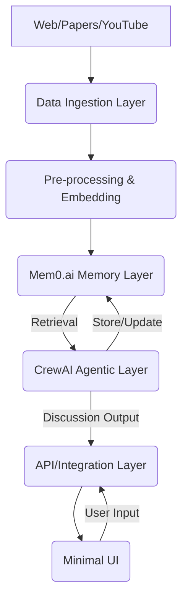

# RAG Scraping Agentic System: Architecture and Component Specifications

This document outlines the architecture and component specifications for a Rust-based RAG (Retrieval-Augmented Generation) scraping agentic system. The system is hyper-specialized for extracting high-level quantum and classical physics information from various sources, storing it in Mem0.ai for Reinforcement Learning (RL) data, and facilitating high-level physics discussions among CrewAI agents representing renowned physicists.

## 1. Overall System Architecture

The system is designed as a modular, event-driven architecture, primarily built with Rust for performance and reliability. It comprises several key layers:

1.  **Data Ingestion Layer**: Responsible for scraping, extracting, and pre-processing physics information from diverse sources.
2.  **Memory Management Layer**: Utilizes Mem0.ai for persistent, intelligent memory storage and retrieval.
3.  **Agentic Layer**: Implements CrewAI agents with distinct physicist personas for specialized discussions.
4.  **API/Integration Layer**: Provides interfaces for interaction and data flow between components.
5.  **Minimal UI Layer**: A lightweight web interface for system monitoring and basic interaction.



**Key Technologies:**
*   **Core Logic**: Rust
*   **Memory**: Mem0.ai
*   **Agent Orchestration**: CrewAI (Python, integrated via API/IPC)
*   **LLM**: Cerebras - gpt-oss-120b (via OpenAI-compatible API)
*   **Web Framework (Minimal UI)**: Rust (e.g., Actix-web, Axum) with a lightweight frontend (e.g., HTMX, vanilla JS).

## 2. Data Ingestion Layer

This layer is responsible for acquiring raw data and transforming it into a structured format suitable for memory storage.

### 2.1. Scraping Modules (Rust)

*   **Web Scraper**: A Rust module utilizing libraries like `reqwest` for HTTP requests and `scraper` or `html5ever` for HTML parsing. It will be configured to target academic paper repositories (e.g., arXiv), physics-related websites, and general web content.
    *   **Functionality**: Fetch HTML, extract main content (articles, abstracts, figures), handle pagination, and manage rate limiting.
*   **YouTube Transcript Extractor**: A Rust module to interact with YouTube APIs or use libraries (e.g., `youtube_dl_rs` or `yt-dlp` via `std::process`) to download video transcripts.
    *   **Functionality**: Given a YouTube URL, retrieve available transcripts (auto-generated or provided), and clean them.
*   **PDF/Document Parser**: A Rust module to extract text from PDF documents (e.g., research papers). Libraries like `pdf` or `poppler-rs` can be explored.
    *   **Functionality**: Open PDF, extract text content, handle different layouts, and potentially extract metadata.

### 2.2. Text Extraction and Pre-processing (Rust)

After raw data acquisition, this component cleans and prepares the text.

*   **Noise Reduction**: Remove boilerplate text, advertisements, navigation elements, and irrelevant sections.
*   **Text Normalization**: Convert text to lowercase, handle special characters, remove extra whitespace.
*   **Sentence Segmentation**: Break down text into sentences for finer-grained processing.
*   **Keyword/Phrase Extraction**: Identify key terms and phrases relevant to quantum and classical physics using NLP techniques (e.g., TF-IDF, RAKE algorithm, or a small, specialized LLM). This will aid in metadata generation for Mem0.

## 3. Memory Management Layer (Mem0.ai)

Mem0.ai will serve as the persistent memory layer for the entire system, storing extracted physics information and agent interaction history.

### 3.1. Mem0.ai Integration (Rust Client / Python Bridge)

Given Mem0.ai primarily offers Python and Node.js SDKs, a strategy for Rust integration is needed:

*   **Option 1 (Rust Client)**: Develop a thin Rust client that interacts directly with the Mem0.ai API (if a REST API is available and documented). This is the preferred approach for a pure Rust solution.
*   **Option 2 (Python Bridge)**: Create a small Python microservice or use FFI (Foreign Function Interface) to call the Mem0 Python SDK from Rust. This would involve passing data between Rust and Python processes.

### 3.2. Data Structuring for Mem0.ai

Following best practices [1], data will be structured to optimize retrieval and learning:

*   **Memory Types**: Utilize Mem0's `Factual Memory` for extracted physics concepts, `Episodic Memory` for agent discussions, and `Semantic Memory` for general knowledge.
*   **Custom Categories**: Implement a hierarchical categorization scheme (e.g., `Physics/Quantum Mechanics`, `Physics/Classical Mechanics`) to organize memories.
*   **Metadata Enrichment**: Each memory will be tagged with comprehensive metadata, including:
    *   `source_url`, `source_type` (web, paper, youtube)
    *   `title`, `author`, `publication_date`
    *   `physics_domain` (quantum, classical, general)
    *   `sub_domain` (e.g., QFT, QM, GR, CM)
    *   `key_concepts` (list of extracted keywords)
    *   `physicist_attribution` (if relevant, e.g., 

Einstein, Feynman)
    *   `confidence_score` (reliability of extraction)
*   **Graph Memory**: Leverage Mem0's graph memory to establish relationships between physics concepts, theories, and physicists. This will enable more nuanced retrieval and understanding of interconnected knowledge.

### 3.3. RL Data Storage

The extracted and structured physics information, along with the interaction history of the CrewAI agents, will serve as the RL data. Mem0's ability to store and retrieve context-aware memories will be crucial for training future RL models to improve agent performance and discussion quality.

## 4. Agentic Layer (CrewAI with Python)

This layer orchestrates the AI agents, enabling them to engage in high-level physics discussions.

### 4.1. CrewAI Integration (Python)

CrewAI will be used to define and manage the agents, tasks, and processes. The integration with Mem0.ai will be done using the provided Python SDK [2].

### 4.2. Physicist Personas

Five distinct agent personas will be created:

*   **Albert Einstein**: Focus on relativity, quantum mechanics foundations, philosophical implications of physics.
*   **Richard Feynman**: Emphasis on quantum electrodynamics, path integrals, pedagogical explanations, problem-solving.
*   **Erwin Schrödinger**: Expertise in wave mechanics, quantum states, philosophical aspects of quantum theory.
*   **Paul Dirac**: Specialization in relativistic quantum mechanics, quantum field theory, mathematical elegance.
*   **Werner Heisenberg**: Focus on matrix mechanics, uncertainty principle, philosophical interpretations of quantum mechanics.

Each persona will have a unique `user_id` in Mem0.ai to maintain separate memory profiles, allowing for personalized knowledge retention and discussion history. This will enable the agents to 

develop distinct viewpoints and contribute authentically to discussions.

### 4.3. Agent Roles and Tasks

*   **Roles**: Each agent will be assigned a specific role reflecting their persona.
*   **Tasks**: Tasks will involve analyzing extracted physics information, formulating arguments, asking questions, and responding to other agents, all while leveraging their Mem0-stored knowledge.
*   **Tools**: Agents will have access to tools for searching Mem0.ai, potentially external search (e.g., SerperDevTool), and an LLM for generating responses.

## 5. API/Integration Layer (Rust)

This layer acts as the communication hub between the Rust-based components and the Python-based CrewAI agents, as well as the minimal UI.

*   **REST API (Rust)**: A Rust web server (e.g., Actix-web, Axum) will expose endpoints for:
    *   Triggering scraping and ingestion tasks.
    *   Initiating agent discussions.
    *   Retrieving discussion history and extracted physics information.
    *   Managing Mem0.ai interactions (if a direct Rust client is implemented).
*   **Inter-Process Communication (IPC)**: If a Python bridge is used for Mem0.ai or CrewAI, IPC mechanisms (e.g., gRPC, ZeroMQ, or simple HTTP requests) will facilitate communication between Rust and Python processes.

## 6. Minimal UI Layer (Rust Web App)

A lightweight web application built with Rust for the backend and a minimal frontend for interaction.

*   **Backend (Rust)**: A web framework like Actix-web or Axum will serve the frontend assets and expose API endpoints.
*   **Frontend (HTML/CSS/Vanilla JS/HTMX)**: A simple interface for:
    *   Initiating data ingestion (e.g., inputting URLs for papers/YouTube videos).
    *   Viewing extracted physics information.
    *   Monitoring agent discussions in real-time.
    *   Displaying discussion transcripts.
    *   Basic configuration of agents or data sources.

## 7. LLM Integration

The Cerebras - gpt-oss-120b model will be used via its OpenAI-compatible API. This LLM will power:

*   **Text Summarization**: For condensing extracted physics information.
*   **Fact Extraction**: To identify key facts and relationships from raw text.
*   **Agent Reasoning**: As the core reasoning engine for CrewAI agents to generate responses and engage in discussions.
*   **Query Understanding**: To interpret user queries for data ingestion or discussion topics.

## 8. Development Roadmap and Scaffolding

### 8.1. Project Structure (Rust)

```
rag_physics_agent/
├── Cargo.toml
├── src/
│   ├── main.rs
│   ├── data_ingestion/
│   │   ├── mod.rs
│   │   ├── scraper.rs         # Web scraping logic
│   │   ├── youtube_parser.rs  # YouTube transcript extraction
│   │   └── pdf_parser.rs      # PDF text extraction
│   ├── pre_processing/
│   │   ├── mod.rs
│   │   └── text_processor.rs  # Text cleaning, normalization, keyword extraction
│   ├── mem0_client/
│   │   ├── mod.rs
│   │   └── client.rs          # Mem0.ai API interaction (Rust client or Python bridge)
│   ├── api/
│   │   ├── mod.rs
│   │   └── server.rs          # REST API endpoints
│   ├── ui/
│   │   ├── mod.rs
│   │   └── web_app.rs         # Minimal UI serving
│   └── utils/
│       └── mod.rs
├── agents/
│   ├── crewai_agents.py       # Python script for CrewAI agents
│   └── personas.json          # Physicist persona definitions
├── data/
│   └── raw_data/              # Scraped raw data
├── config/
│   └── settings.toml          # Configuration settings
└── docs/
    └── architecture.md        # This document
```

### 8.2. Scaffolding Tasks

1.  **Rust Project Setup**: Initialize a new Rust project with `cargo new rag_physics_agent`.
2.  **Dependency Management**: Add necessary Rust crates (`reqwest`, `scraper`, `tokio`, `actix-web`/`axum`, `serde`, `anyhow`, `thiserror`).
3.  **Basic Web Server**: Implement a minimal Rust web server to serve a static HTML page.
4.  **Python Environment**: Set up a Python virtual environment for CrewAI and Mem0.ai SDKs.
5.  **Mem0.ai Python Client**: Create a basic Python script to interact with Mem0.ai using the provided API key.
6.  **CrewAI Agent Placeholder**: Create a simple CrewAI agent definition in Python.
7.  **Configuration Management**: Implement `config.rs` to load settings from `settings.toml`.

## 9. Further Development and Training

### 9.1. Data Acquisition

*   **Targeted Scraping**: Develop more sophisticated scraping rules for specific physics journals, arXiv categories, and educational resources.
*   **YouTube API Integration**: Utilize the YouTube Data API for more robust transcript extraction and video metadata.

### 9.2. Advanced NLP for Extraction

*   **Named Entity Recognition (NER)**: Identify physics-specific entities (e.g., particles, forces, theories, scientists).
*   **Relation Extraction**: Discover relationships between identified entities.
*   **Abstractive Summarization**: Generate concise summaries of complex physics concepts.

### 9.3. RL Data Utilization

*   **Feedback Loop**: Implement a feedback mechanism where agent discussion outcomes (e.g., consensus, unresolved questions) are used to refine Mem0.ai memories or trigger further data acquisition.
*   **RL Model Training**: Use the structured data in Mem0.ai to train RL models that optimize agent behavior, discussion strategies, or knowledge retrieval.

### 9.4. UI Enhancements

*   **Interactive Knowledge Graph**: Visualize the relationships between physics concepts stored in Mem0.ai.
*   **Agent Dashboard**: Provide detailed insights into agent activity, memory usage, and discussion progress.
*   **Query Interface**: Allow users to pose complex physics questions to the agent collective.

## References

[1] Mem0.ai Best Practices for RL Data Storage and Structuring. (2025). Local document: `mem0_rl_data_best_practices.md`.
[2] CrewAI - Mem0. (n.d.). *Mem0 Documentation*. Retrieved from [https://docs.mem0.ai/integrations/crewai](https://docs.mem0.ai/integrations/crewai)

